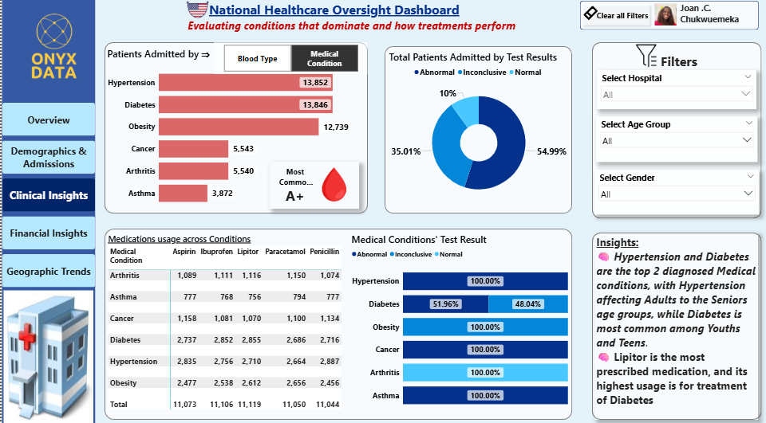
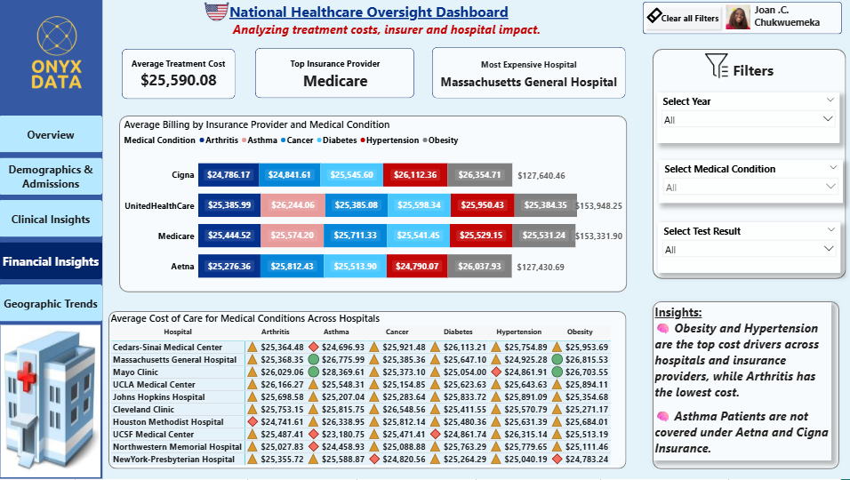
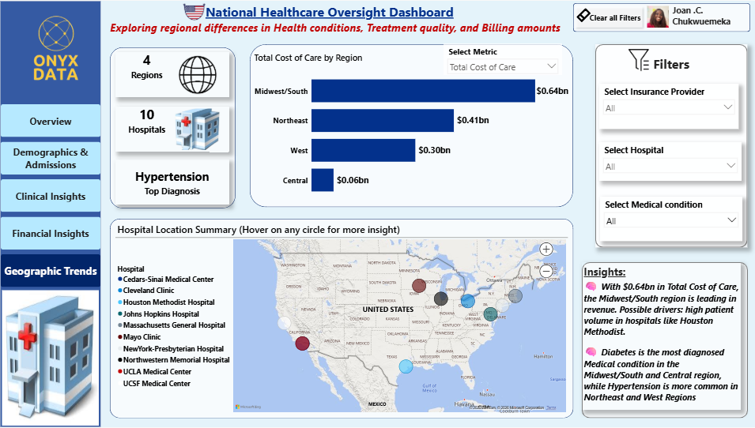

# National-Healthcare-Oversight-Analysis

## Business Problem
National healthcare oversight organizations and insurance partners require timely, data-driven insights to 
identify high-risk patient populations, manage prolonged hospital stays, and control rising healthcare costs.
Fragmented data across hospitals, conditions, and regions limits the ability to detect cost drivers, utilization
patterns, and care disparities early enough for proactive intervention.

## Objective
- Analyze large-scale patient-level healthcare data to identify high-risk populations
- Evaluate utilization patterns, clinical conditions, and cost drivers across hospitals
- Support population health management, cost optimization, and policy decision-making

**Key KPIs**
- Total Patients Admitted
- Average Length of Stay
- Total Cost of Care
- Admissions by Type (Elective, Emergency, Urgent)
- Cost of Care by Medical Condition

## Dataset
Source: Onyx Data – DataDNA April 2025 Challenge
Records: 55,000+ patient records
Coverage: 10 major U.S. hospitals
Time Period: Multi-year patient admission data
** Key Fields:
 - Patient demographics (Age group, Gender)
 - Admission type
 - Medical condition / diagnosis
 - Length of stay
 - Cost of care
 - Medication
 - Insurance provider
 - Hospital and geographic region

rd storytelling aligned to healthcare stakeholder use cases

  ## Tools Used
- Power BI

## Analysis Approach

### Data Preparation
- Data profiling and validation
- Creation of calculated columns and measures using DAX

### Exploratory & Diagnostic Analysis
- Admission trends over time (COVID-19 impact)
- Demographic and hospital-level admission patterns

### Metrics & Calculations
- Cost of care by medical condition, hospital, and insurance provider
- Length of stay vs cost analysis

### Visualization & Storytelling
- Multi-page dashboard with structured storytelling flow:
  - Executive Overview
  - Demographics & Admissions
  - Clinical Insights
  - Financial Analytics
  - Geographic Trends

## Key Insights
- COVID-19 caused a significant spike in patient admissions in 2020.
- Cost of care per patient is more dependent on medical condition than length of stay  
  *(e.g., Hypertension and Arthritis have similar lengths of stay but very different costs).*
- Elective admissions dominate, with Females and Seniors (65+) accounting for over 50% of total admissions.
- Houston Methodist Hospital accounts for over 40% of total patient admissions.
- Hypertension and Diabetes are the top diagnosed medical conditions, with distinct age-group patterns.
  
  
  
- Obesity and Hypertension are the highest cost drivers, while Arthritis incurs the lowest cost.
- Asthma patients are not covered under Aetna and Cigna insurance providers.

 
  
- The Midwest/South region leads in total cost of care ($0.64bn), driven by high patient volume.

## Recommendations
### Healthcare Administrators
- Focus preventive care and chronic disease management on high-volume hospitals and regions.

### Physicians & Medical Teams
- Prioritize proactive management of Hypertension, Diabetes, and Obesity to reduce long-term costs.

### Insurance Partners
- Reassess coverage gaps (e.g., asthma exclusions) and apply risk-based segmentation for policy design.
 
## Impact
This dashboard enables healthcare administrators and insurance partners to:
- Detect high-risk patient cohorts earlier
- Understand condition-driven cost patterns beyond length of stay
- Identify hospital and regional care disparities
- Support proactive, data-informed healthcare and insurance decisions

## Deliverables
- Interactive Power BI Healthcare Analytics Dashboard

🔗 **Live Dashboard:** [Link](https://app.powerbi.com/view?r=eyJrIjoiNzcxNmY5YTMtYTJiNC00MTc5LWIxYjgtZTljMmMxNjg0ODdhIiwidCI6ImFiMTA0YzYwLTZkZTYtNDc1ZC1hMjBmLTg5M2Y2OWQ2NzlhNCJ9&pageName=7419f664ec665ddaa087)

## Skills Demonstrated
- Healthcare data analysis and interpretation
- Power BI data modeling and star schema design
- DAX measures for KPIs and advanced calculations
- Cost and utilization analysis
- Multi-page dashboard design with data storytelling
- Stakeholder-focused insight communication
